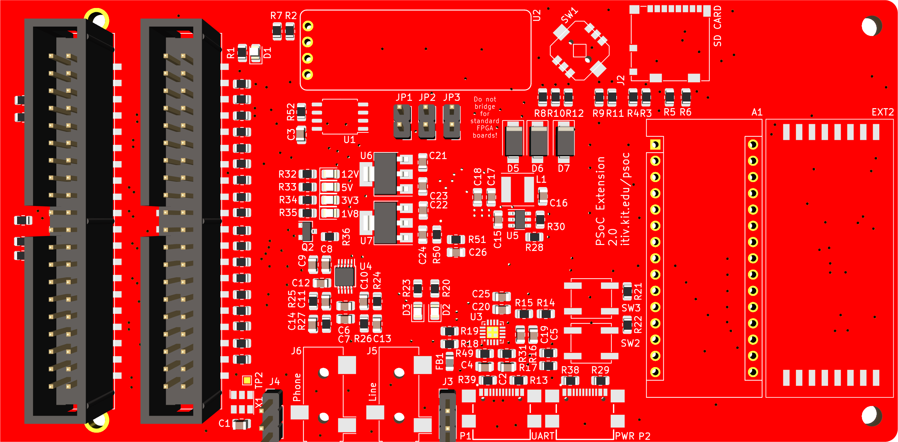
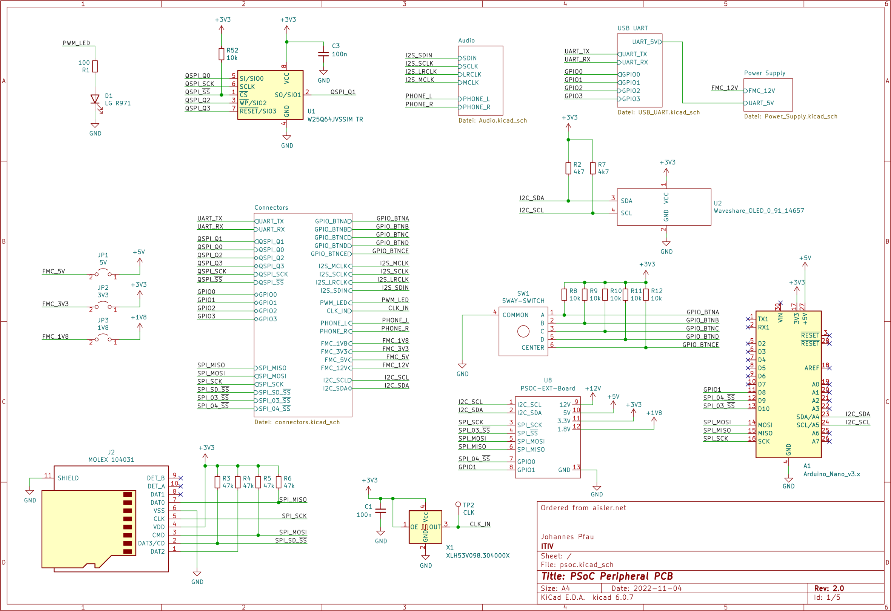

# PSoC FMC Extension PCB

This repository contains schematic, layout and BOM for the PSoC FMC extension PCB.
The PCB provides all peripherals that are used to realize the [PSoC Audio Player](https://kch.dev/psoc).
It is primarily meant to be used with the Zedboard for FPGA prototyping, but it can also serve as a test board for the PSoC ASIC.

The following features are provided by the PCB:
* 98.304 MHz oscillator ([XLH53V098.304000X](doc/REN_XL_Crystal_Oscillators_Datasheet_DST_20220302-1954959-1.pdf)) for SoC clock
* 64 MBit QSPI Flash ([W25Q64JVSSIM](doc/w25q64jv_dtr_revj_03272018_plus-1489809.pdf))
* USB/UART bridge ([CP2102N](doc/cp2102n_datasheet-1634912.pdf))
* 3 LEDs
* 2 [push buttons](doc/EVPBF.pdf)
* [5-way digital joystick](doc/SKRHAAE010.pdf)
* 128x32 [OLED display](https://www.waveshare.com/0.91inch-oled-module.htm) (I2C)
* I2S DAC with output filter networks ([CS4344-CZZR](doc/CS4344-45-48_F2.pdf))
* [3.5mm audio jack](doc/sj_352x_smt-1779397.pdf) for I2S DAC
* [3.5mm audio jack](doc/sj_352x_smt-1779397.pdf) directly connected to FMC
* [MicroSD card connector](doc/MOLEX_472192001_sd.pdf) (1-bit data line only)
* Power switch network: Power PCB from FMC 12V, power connector or UART usb connector
* 5V power regulator ([AP62300WU](doc/AP62300_AP62301_AP62300T.pdf))
* 3.3V power regulator (AMS1117-3.3)
* 1.8V power regulator (LM1117MPX-ADJ)
* Power indicator LEDs
* [USB-C connector](doc/usb4110.pdf) for UART
* [USB-C connector](doc/usb4110.pdf) for power
* [FMC LPC connector](doc/asp-134604-01-mkt-1546032.pdf) to connect to FPGA or ASIC
* 2 [40-pin pin headers](doc/SBH11-NBPC.pdf) for debugging of any signal
* Connector for future extensions (based on KiCAD RFM69HW footprint)
* Arduino-like connector for future extensions

For more details, see the [schematic](psoc.pdf):

## Ordering the PCBs

PCBs were ordered from [aisler](aisler.net) using the [fab.zip](fab.zip) file.
Make sure to use a stencil with 150µm thickness for proper FMC connector soldering.

## More Information and Documentation

* Project Website and Documentation: [kch.dev/psoc](https://kch.dev/psoc)
* Project Schematic: [psoc-pdf](psoc.pdf)

Additional documentation:
* [FMC Documentation](https://fmchub.github.io/appendix/VITA57_FMC_HPC_LPC_SIGNALS_AND_PINOUT.html)
* [USB-C Termination](https://community.cypress.com/t5/Knowledge-Base-Articles/Termination-Resistors-Required-for-the-USB-Type-C-Connector/ta-p/253544)
* [Audio TRS Standard](https://components101.com/connectors/35mm-audio-jack)

## Note and Limitations

### JTAG

* The board unfortunately does not provide convenient access to JTAG pins, although the debug header can be used.
  As a workaround, [psoc-pcb-jtag](https://github.com/kit-kch/psoc-pcb-jtag) can be connected to the USB header.

### Powering the IHP ASIC

The [IHP SG13G2 ASIC](https://github.com/IHP-GmbH/TO_Sep2025/pull/4) requires an 1.2V source instead of the 1.8V on this board.
Although the regulator on the board is adjustable, it can't go down to 1.2V.

As a simple solution, some parts can be replaced to provide 1.2V output:
* `U7` with `TLV76112DCYR` 1A 1.2V regulator
* `R51` with 0 Ohm (short)
* Remove `R50`
* Remove `C26`
